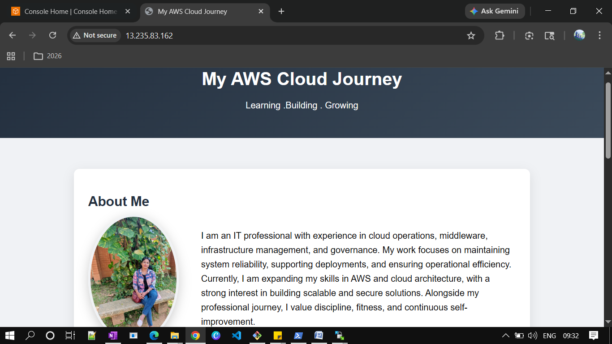
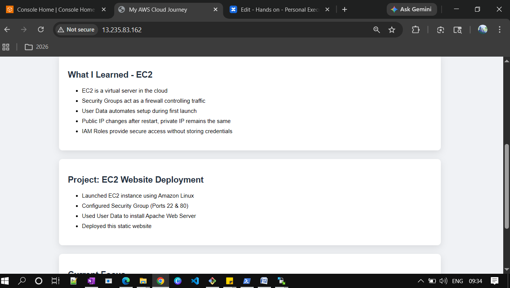
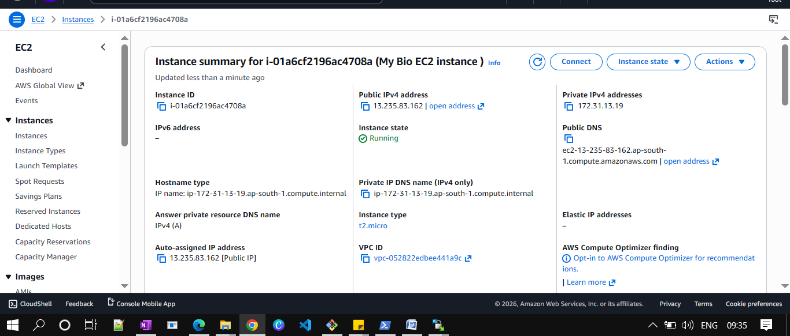
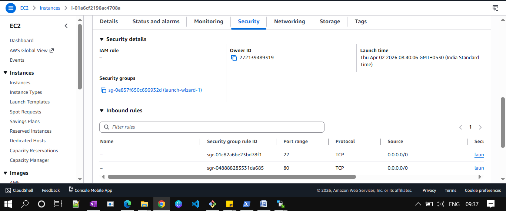

# EC2 Static Website Deployment

##  Overview

This project demonstrates hosting a static website on AWS EC2 using automated setup with User Data.

---

##  What I Built

* Launched an EC2 instance (Amazon Linux)
* Installed Apache Web Server using User Data
* Deployed a static HTML website
* Added personal profile and project details
* Configured Security Groups for web access

---

##  Services Used

* EC2 (Elastic Compute Cloud)
* Security Groups
* EBS

---

## Implementation Steps

1. Launched EC2 instance
2. Selected t2.micro (Free Tier)
3. Created key pair for SSH access
4. Configured Security Group:

   * Port 22 → SSH
   * Port 80 → HTTP
5. Added User Data script to:

   * Install Apache
   * Deploy website
6. Accessed application using public IP

---

## Screenshots - images folder

### Website Output

### EC2 Instance Details

---

##  Key Learnings

* EC2 acts as a virtual server in cloud
* Security Groups control traffic access
* User Data automates initial setup
* Public IP changes after restart
* IAM Roles are preferred over access keys

---

## Note

The EC2 instance was stopped after testing to avoid unnecessary charges.

---

